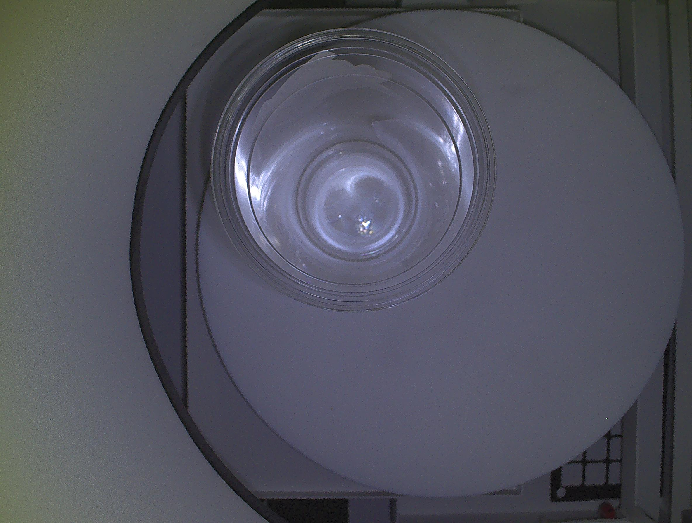
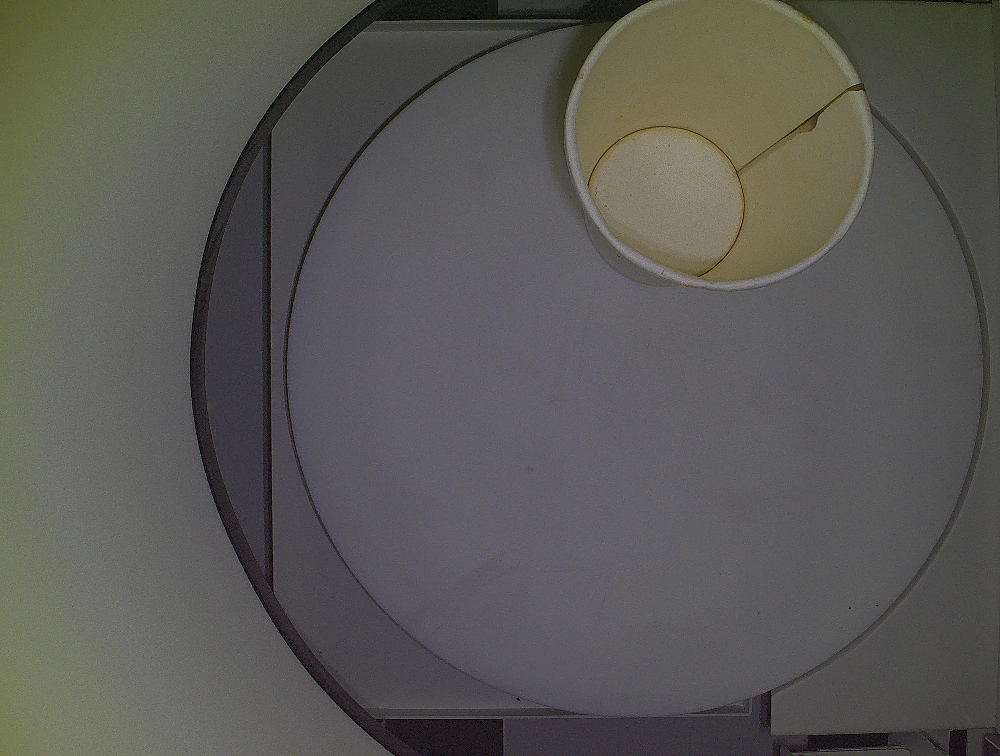

# 🥤 Cup Return Vision System

> AI 기반 이중 카메라 컵 판별 시스템 — 자동 반납기용 컴퓨터 비전 솔루션

<br>

## 📌 프로젝트 개요

일회용 컵 자동 반납기에 탑재되는 컴퓨터 비전 시스템입니다.  
**측면 카메라**와 **상단 카메라** 두 대를 병렬로 운용하여 컵의 반납 가능 여부를 실시간으로 판별합니다.

| 항목 | 내용 |
|------|------|
| 개발 기간 | 2026.04 ~ 2026.05 |
| 개발 환경 | Python 3.11, Windows |
| 카메라 | iRAYPLE SS5050CG-08M (상단), SS5016CG-08M (측면) |
| AI 플랫폼 | iRAYPLE EasyVS |
| 통신 방식 | TCP Socket, FTP |

<br>

## 🔍 판별 항목

### 측면 카메라
- 바코드 인식 (회전 발판 구조 대응 — 1개 이상 인식 시 성공)
- 뚜껑 유무 판별
- 홀더 유무 판별

### 상단 카메라
```
001. 컵 종류 분류 (종이컵 / 플라스틱컵)
002. 종이컵 이물질 유무
003. 플라스틱컵 이물질 유무
004. 음료 유무
005. 쓰레기 유무
006. 얼음 유무
```

### 최종 판정 로직
```
반납 승인 = 바코드 인식 성공
          AND 뚜껑 없음
          AND 홀더 없음
          AND 이물질 없음 (002 또는 003~006 전부 없음)
```

<br>

## 🏗️ 시스템 아키텍처

```
┌─────────────────────────────────────────┐
│              반납기 미니PC               │
│                                         │
│  ┌──────────┐      ┌──────────────────┐ │
│  │ 상단카메라│      │    main.py       │ │
│  │(5MP 컵분류│─TCP─▶│  run_inspection()│ │
│  │ 이물질감지│      │                  │ │
│  └──────────┘      │  ┌────────────┐  │ │
│                    │  │ vote.py    │  │ │
│  ┌──────────┐      │  │가중 투표   │  │ │
│  │ 측면카메라│─TCP─▶│  │알고리즘    │  │ │
│  │(바코드/뚜껑│     │  └────────────┘  │ │
│  │ 홀더감지) │      └──────────────────┘ │
│  └──────────┘              │             │
│           ┌────────────────┘             │
│           ▼                              │
│     판별 결과 반환 → 디바이스팀 서버 연동  │
│     이미지/JSON → FTP 자동 저장           │
└─────────────────────────────────────────┘
```

<br>

## 📁 프로젝트 구조

```
cup-return-vision-system/
├── main.py                  # 진입점 — 전체 판별 흐름 제어
├── config.example.py        # 설정 파일 템플릿 (실제 config.py는 .gitignore 처리)
│
├── camera/
│   ├── side_camera.py       # 측면 카메라 TCP 통신 및 결과 파싱
│   └── top_camera.py        # 상단 카메라 TCP 통신 및 결과 파싱
│
├── core/
│   ├── vote.py              # 가중 투표 알고리즘 (핵심 로직)
│   ├── socket_manager.py    # 소켓 연결/재연결 관리
│   └── ftp_handler.py       # 이미지/JSON FTP 저장 (멀티프로세스)
│
└── storage/
    ├── file_manager.py      # 저장 경로 및 파일 관리
    ├── stats_manager.py     # 반납 통계 관리
    └── log_manager.py       # 로그 기록
```

<br>

## ⚙️ 핵심 알고리즘 — 가중 투표 (vote.py)

10개 프레임을 촬영하여 신뢰도 기반 가중 투표로 최종 판별 결과를 도출합니다.

```python
# 유효 프레임만 추려서 신뢰도 × 연속 가중치로 계산
# 아래 조건 중 하나라도 미달 시 vote 실패 처리
MIN_SCORE      = 60    # 유효 프레임 최소 스코어
MIN_SCORE_GAP  = 5     # 1위-2위 스코어 최소 격차
MIN_CONFIDENCE = 0.50  # 최소 신뢰도
MAX_STD        = 20    # 최대 허용 표준편차
```

**바코드 투표:** 10개 프레임 중 인식 성공 프레임이 1개 이상이면 성공 처리  
→ 회전 발판 구조상 바코드가 잠깐만 보여도 인식 가능하도록 설계

<br>

## 🤖 AI 모델 학습

iRAYPLE EasyVS MVP 플랫폼을 활용하여 직접 AI 분류 모델을 학습시켰습니다.

| 모델 | 분류 항목 | 비고 |
|------|----------|------|
| 001 | 종이컵 / 플라스틱컵 분류 | 컵 종류 1차 분류 |
| 002 | 종이컵 이물질 유무 | 음료/쓰레기/얼음 포함 |
| 003 | 플라스틱컵 이물질 유무 | 찌그러진 컵 케이스 포함 재학습 |
| 004 | 음료 유무 | 플라스틱컵 세부 판별 |
| 005 | 쓰레기 유무 | 플라스틱컵 세부 판별 |
| 006 | 얼음 유무 | 소량 얼음 감지 포함 재학습 |

- 컵 유형별 (종이컵/투명 플라스틱컵/로고 플라스틱컵) 전 상태(깨끗/뚜껑/홀더/쓰레기/음료/얼음) 직접 촬영 및 라벨링
- 찌그러진 컵, 소량 이물질 등 예외 케이스 발견 시 추가 데이터 수집 및 반복 재학습
- 재학습 전후 성능 비교 테스트를 통해 모델 정확도 검증

<br>

## 📊 성능

| 판별 항목 | 성공률 |
|----------|--------|
| 홀더 거부 | ✅ 100% |
| 뚜껑 거부 | ✅ 100% |
| 쓰레기 거부 | ✅ 95%+ |
| 음료 거부 | ✅ 95%+ |
| 얼음 거부 | ✅ 95%+ |
| 깨끗한 컵 pass | ✅ 95%+ |

**처리 시간:** 약 7.60초 (초기 17.6초 대비 56% 단축)
- 멀티프로세스 FTP 저장 분리로 상단 처리 시간 2.5초 단축

<br>

## 🚀 시작하기

```bash
# 1. 저장소 클론
git clone https://github.com/GY-H08/cup-return-vision-system.git
cd cup-return-vision-system

# 2. 설정 파일 생성
cp config.example.py config.py
# config.py에서 카메라 IP 주소 등 환경에 맞게 수정

# 3. 실행
python main.py
```

<br>

## 🔧 주요 기술적 도전 및 해결

**1. 모델 전환 딜레이 문제**  
초기 5개 프로젝트 순차 전환 방식 → 전환 시 약 9초 딜레이 발생  
→ 단일 프로젝트 멀티 Tool 구조로 전환, 딜레이 완전 제거

**2. 처리 시간 단축**  
FTP 저장이 판별 시간에 포함되어 병목 발생  
→ 멀티프로세스로 FTP 저장 분리, 약 2.5초 단축

**3. 찌그러진 컵 오판 문제**  
컵 표면 굴곡을 이물질로 오판 (재학습 전 15건 중 12건 오거부)  
→ 찌그러진 컵 데이터 추가 수집 및 재학습으로 4/5건 정상 판별

**4. 촬영 높이 최적화**  
35cm vs 50cm 두 가지 방식 비교 테스트  
→ 50cm에서 판별 정확도 및 처리 속도 모두 우위, 최종 채택

<br>

## 📝 설정 항목 (config.example.py)

```python
SIDE_HOST = "xxx.xxx.xxx.xxx"  # 측면 카메라 IP
TOP_HOST  = "xxx.xxx.xxx.xxx"  # 상단 카메라 IP
TCP_PORT  = 3000               # TCP 포트

FRAME_COUNT    = 10    # 판별 프레임 수
MIN_SCORE      = 60    # 최소 유효 스코어
MAX_RETRY      = 3     # 판별 실패 시 재시도 횟수
SOCKET_TIMEOUT = 10.0  # 소켓 응답 대기 시간 (초)
```

<br>

## 🔗 연동 구조

본 시스템은 `run_inspection()` 함수로 판별 결과 dict를 반환하며,  
FastAPI 기반 디바이스팀 메인 서버와 TCP 소켓으로 연동됩니다.

```python
result = run_inspection()
# {
#   "result": "pass" | "fail",
#   "reason": None | "barcode_failed" | "lid_detected" | ...,
#   "elapsed_sec": 7.6,
#   ...
# }
```
<br>

## 📷 실제 동작 예시

### 플라스틱컵 — 반납 승인


```json
{
  "cup_type": "플라스틱컵",
  "cup_type_score": 98.8,
  "foreign_material": "이물질 없음",
  "foreign_score": 99.0,
  "passed": true,
  "elapsed_sec": 5.432
}
```

### 종이컵 — 반납 승인


```json
{
  "cup_type": "종이컵",
  "cup_type_score": 96.3,
  "foreign_material": "이물질 없음",
  "foreign_score": 78.8,
  "passed": true,
  "elapsed_sec": 5.404
}
```
